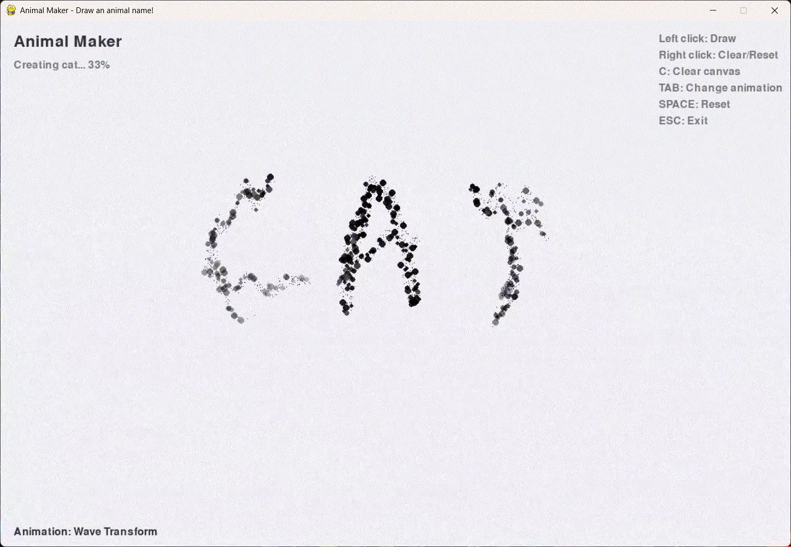

# AnimalMaker

A Python application that transforms handwritten animal names into black and white silhouettes with smooth wave animations. Draw an animal name with your mouse, wait and watch your handwriting transform into a dithered silhouette over time.

[](assets/animaldemo.mp4)

*Click the image above to watch the demo video*

Created for my little cousin who is learning about animals for the first time <3

## Installation

### Prerequisites
- Python 3.8+
- Tesseract OCR
- Unsplash API key (required for animal images)

### Step 1: Install Dependencies
```bash
pip install -r requirements.txt
```

### Step 2: Install Tesseract OCR

**Windows:**
1. Download from [UB-Mannheim/tesseract](https://github.com/UB-Mannheim/tesseract/wiki)
2. Install and add to PATH

**macOS:**
```bash
brew install tesseract
```

**Linux:**
```bash
sudo apt install tesseract-ocr tesseract-ocr-eng
```

### Step 3: Configure Unsplash API
1. Get a free API key from [Unsplash Developers](https://unsplash.com/developers)
2. Edit `src/config.py`:
   ```python
   UNSPLASH_API_KEY = "your_actual_api_key_here"
   ```

### Step 4: Run
```bash
python main.py
```

## Usage

1. **Draw**: Use left mouse to write an animal name on the canvas
2. **Wait**: Stop drawing and wait 3 seconds for OCR processing
3. **Watch**: Animations transform handwriting into silhouette

### Controls
- Left Mouse: Draw
- Right Mouse: Clear/Reset
- C: Clear canvas
- TAB: Change animation type
- SPACE: Reset
- ESC: Exit

### Supported Animals
cat, dog, elephant, lion, tiger, bear, wolf, fox, rabbit, horse, cow, pig, sheep, goat, deer, zebra, giraffe, hippo, rhino, monkey, bird, eagle, owl, penguin, snake, turtle, fish, shark, whale, dolphin, butterfly, bee, spider, and 30+ more.

## Technical Details

### Architecture
- **Drawing Canvas** (`drawing_canvas.py`): Pygame-based drawing with mouse input and idle detection
- **OCR Recognition** (`ocr_recognition.py`): Dual OCR system using Tesseract and EasyOCR with fuzzy matching
- **Animation System** (`animation_system.py`): Particle-based wave animation with 25-second duration
- **Image Processing** (`animal_maker.py`): Floyd-Steinberg dithering for black/white conversion
- **Image Management** (`animal_image_manager.py`): Unsplash API integration with randomized fetching

### Key Features
- **Floyd-Steinberg Dithering**: High-quality black and white silhouettes
- **Transform Animations**: Wave transform, falling sand etc. particle physics animation
- **Dual OCR**: Tesseract + EasyOCR for robust handwriting recognition
- **Particle Physics**: 1000+ particles with gravity, friction, and wave motion


